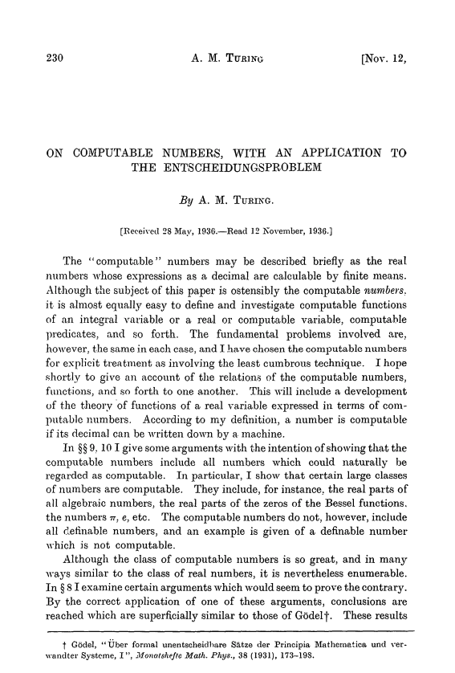

build-lists: true
autoscale: true

# Playing with Lambda Calculus
## Bernardo Amorim

---


# Alonzo Church


^ That dates back to 1936, when Alonzo Church created this thing called lambda calculus in order to formalize computability.

---




^ Funny enough, it was published mostly at the same time that the famous paper from Alan Turing that introduced Turing Machines, which was later proven to be equivalent in terms on what they can compute.

---

# Turing Completeness
## and the Church-Turing thesis

^ Defines computability on what a Turing Machine or Lambda Calculus can compute. So a system is said to be turing-complete if it can implement a turing machine (or a lambda calculus reductor).

---

# λ-calculus

* Formalism that defines computability
* Based on simple functions that:
  * Are anonymous
  * Are curried (1 argument function only)
* Defines a simple syntax for defining a **Lambda Term**

---

# λ-calculus syntax

| Constructor | Lambda |
| --- | --- |
| Variable | `x`, `y`, `my_var` |
| Abstraction | `λx. BODY` |
| Application | `A B` |

---

# Application is left associative

## a b c = (a b) c

## a b c ≠ a (b c)

^ This is like haskell

---

## λx. λy. y x ≠ λx. (λy. y) x

---

```
λx. x
λx. x x
λx. x x x
(λx. x) (λx. x)
λf. λx. x
λf. λx. f x
λf. λx. f (f (f (f x)))
```

---

# Lambda Calculus in Elixir

---

# Programming Challenge

## Weird sub-set of Elixir

^ So, I’m going to create a challenge. The idea is to program in elixir using only the following subset of the language.

---

# Weird sub-set of Elixir

## Valid **terms** can be:

* Variable names such as `x`, `y`, or `my_variable`
* Anonymous functions definitions like `fn x -> BODY end` where `BODY` is also a valid **term**.
* Application of functions, like `A.(B)` where both `A` and `B` are valid **terms**.

---

# Weird sub-set of Elixir

```elixir
fn x -> x end
fn x -> x.(x) end
fn x -> x.(x).(x) end
(fn x -> x end).(fn x -> x end)
fn _ -> fn x -> x end end
fn f -> fn x -> f.(x) end end
fn f -> fn x -> f.(f.(f.(f.(x)))) end end
```

---

# Remember this?

```
λx. x
λx. x x
λx. x x x
(λx. x) (λx. x)
λf. λx. x
λf. λx. f x
λf. λx. f (f (f (f x)))
```

---

[.text: alignment(center)]

# Weird sub-set of Elixir

This is **Turing-Complete**

---

# Here is a factorial function.

---

```elixir
(fn f -> (fn x -> x.(x) end).(fn x -> f.(
fn y -> x.(x).(y) end) end) end).(fn fact ->
fn n -> (fn b -> fn tf -> fn ff -> b.(tf).(ff).(b)
end end end).((fn n -> n.(fn _ -> fn _ -> fn f ->
f end end end).(fn t -> fn _ -> t end end) end).
(n)).(fn _ -> fn f -> fn x -> f.(x) end end end).
(fn _ -> (fn n -> fn m -> fn f -> fn x -> n.(m.(f))
.(x) end end end end).(n).(fact.((fn n -> fn f ->
fn x -> n.(fn g -> fn h -> h.(g.(f)) end end).
(fn _ -> x end).(fn u -> u end) end end end).(n)))
end) end end)
```

^ Weird, right? I mean...

---


^ Wat. Makes no sense. Or does it?

---

```elixir
iex(5)> fact = (fn f -> (fn x -> x.(x) end).(fn x -> f.(fn y
-> x.(x).(y) end) end) end).(fn fact -> fn n -> (fn b -> fn
tf -> fn ff -> b.(tf).(ff).(b) end end end).((fn n -> n.(fn
_ -> fn _ -> fn f -> f end end end).(fn t -> fn _ -> t end
end) end).(n)).(fn _ -> fn f -> fn x -> f.(x) end end end).
(fn _ -> (fn n -> fn m -> fn f -> fn x -> n.(m.(f)).(x) end
end end end).(n).(fact.((fn n -> fn f -> fn x -> n.(fn g ->
fn h -> h.(g.(f)) end end).(fn _ -> x end).(fn u -> u end)
end end end).(n))) end) end end)
#Function<7.91303403/1 in :erl_eval.expr/5>
```

---

# Encoding and Decoding

```elixir
5
|> number_to_lambda.()
|> fact.()
|> lambda_to_number.()
```

^
Since this thing can only work with functions, we cannot pipe
Elixir Numbers into that, so we need some kind of encoding and decoding mechanism, which I'll assume we have for now (we actually do)

---

# Encoding and Decoding

```elixir
iex(6)> 5 |>
...(6)> number_to_lambda.() |>
...(6)> fact.() |>
...(6)> lambda_to_number.()
120
```

---


^ But don't panic, we are going to get there

---

# The simplest λ-term

## The identity function

* `λx. x`

* ```elixir
  fn x -> x end
  ```

---

# The simplest λ-term

```elixir
iex(1)> id = fn x -> x end
#Function<7.91303403/1 in :erl_eval.expr/5>
iex(2)> id.(true)
true
```

---

# Boolean Encoding in Lambda Terms

---

## That is: encode **True** and **False**

#### P.S.: There are infinite ways of doing this

---

# What are booleans used for?

---

# Branching
## Pick one of two paths

---

# `λ?. ???`

---

# `λthen. λelse. ???`

---

# True: `λthen. λelse. then`
# False: `λthen. λelse. else`

---

# Church Booleans

---

# In Elixir

```elixir
# True
fn then_path -> fn _ -> then_path end end

# False
fn _ -> fn false_path -> false_path end end
```

---

```elixir
iex(3)> true! = fn t -> fn _ -> t end end
#Function<7.91303403/1 in :erl_eval.expr/5>
iex(4)> false! = fn _ -> fn f -> f end end
#Function<7.91303403/1 in :erl_eval.expr/5>
iex(5)> true!.("This if true").("This if false")
"This if true"
iex(6)> false!.("This if true").("This if false")
"This if false"
```

---

[.code-highlight: 2,4]

```
iex(3)> true! = fn t -> fn _ -> t end end
#Function<7.91303403/1 in :erl_eval.expr/5>
iex(4)> false! = fn _ -> fn f -> f end end
#Function<7.91303403/1 in :erl_eval.expr/5>
iex(5)> true!.("This if true").("This if false")
"This if true"
iex(6)> false!.("This if true").("This if false")
"This if false"
```

^ Not helpful representation

---

# Decoding Booleans

---

## Need a way to check the result

---

# Let's cheat

We can apply non-lambda terms to our lambda term

---

# Let's cheat

We can apply non-lambda terms to our lambda term

```elixir
encoded_boolean.(true).(false)

```

---

```elixir
  iex(7)> lambda_to_bool = fn b -> b.(true).(false) end
  #Function<7.91303403/1 in :erl_eval.expr/5>
  iex(8)> lambda_to_bool.(true!)
  true
  iex(9)> lambda_to_bool.(false!)
  false
  ```

---

# Operations on Booleans

---

# Negation Function

---

# Negation Function

| `a` | `not a` |
| --- | --- |
| `true` | `false` |
| `false` | `true` |

---

# Negation Function

## `λa. ???`

---

# Negation Function

## `λa. a ?WHEN_TRUE? ?WHEN_FALSE?`

---

# Negation Function

## `λa. a FALSE TRUE`

---

# Negation Function

```elixir
fn a ->
  a.(false!).(true!)
end
```

---

# Negation Function

```elixir
iex(10)> not! = fn a -> a.(false!).(true!) end
#Function<7.91303403/1 in :erl_eval.expr/5>
iex(11)> true! |> not!.() |> lambda_to_bool.()
false
iex(12)> false! |> not!.() |> lambda_to_bool.()
true
```
---

# And Function

---

# And Function

| `a` | `b` | `and a b` |
| --- | --- | --- |
| `true` | `true` | `true` |
| `true` | `false` | `false` |
| `false` | `true` | `false` |
| `false` | `false` | `false` |

---

# And Function

## `λa. λb. ???`

^ It receives two booleans and has to do something with it

---

# And Function

## `λa. λb. a ??? ???`

^
We can start looking at a.
The thing is that not is a short-circuit on false values
That is, if one is false, then it doesn't matter the value of the
other because the result is going to be false

---

# And Function

## `λa. λb. a ??? FALSE`

^
In order to not depend on external definitions
We can use a because we know that is false already

---

# And Function

## `λa. λb. a b FALSE`

---

# And Function

```elixir
fn a -> fn b ->
  a.(b).(false!)
end end
```

---

# And Function

```elixir
iex(13)> and! = fn a -> fn b -> a.(b).(false!) end end
#Function<7.91303403/1 in :erl_eval.expr/5>
iex(14)> and!.(true!).(true!) |> lambda_to_bool.()
true
iex(15)> and!.(true!).(false!) |> lambda_to_bool.()
false
iex(16)> and!.(false!).(true!) |> lambda_to_bool.()
false
iex(17)> and!.(false!).(false!) |> lambda_to_bool.()
false
```

---

# Other Logic Gates

---

# NAND Logic
## [fit] With `not` and `and` you can implement all other gates

---

# Encoding Natural Numbers

---

# That is: encode **0**, **1**, **2**, ...

#### P.S.: There are also infinite ways of doing this

---

# What natural numbers are used for?

---

# Counting things

---

# Church Numerals

## [fit] Count the number of times a function is applied to a given input

---

# N
# [fit] `λf. λx. F_APPLIED_TO_X_N_TIMES`

---

| Number | Encoding |
| :---: | --- |
| **0** | `λf. λx. x` |
| **1** | `λf. λx. f x` |
| **2** | `λf. λx. f (f x)` |
| **3** | `λf. λx. f (f (f x))` |
| **4** | `λf. λx. f (f (f (f x)))` |

---

# Constructing Natural Numbers

* We need zero
* And a way to get N+1 given N (successor)

---

# Zero

## `λf. λx. x`

---

# Zero

```elixir
fn _f -> fn x -> x end end
```

---

# Successor Function

## `λn. ???`

^
This is a function that receives a number and should return this number + 1
But we know the "form" of a function

---

# Successor function

## `λn. (λf. λx. ???)`

### Apply `f` to `x` N+1 times

^
Now what the internal function should return is, if `n` receives a function and an input and applies the function to the input *N* times,
then we need to apply `f` *N+1* times to `x`.

---

# Applying N times
## `n f x`

---

# Successor function

## `λn. (λf. λx. ??? (n f x))`

^
Well, `(n f x)` will already apply `f` to `x` *N* times
Then we just need to apply one more time.

---

# Successor function

## `λn. (λf. λx. f (n f x))`

---

# Successor function

## `λn. λf. λx. f (n f x)`

---

# Successor Function

```elixir
fn n -> fn f -> fn x ->
  f.(
    n.(f).(x)
  )
end end end
```

---

```elixir
ex(18)> zero = fn _f -> fn x -> x end end
#Function<7.91303403/1 in :erl_eval.expr/5>
iex(19)> succ = fn n -> fn f -> fn x -> f.(n.(f).(x)) end end end
#Function<7.91303403/1 in :erl_eval.expr/5>
iex(20)> one = succ.(zero)
#Function<7.91303403/1 in :erl_eval.expr/5>
iex(21)> two = succ.(succ.(zero))
#Function<7.91303403/1 in :erl_eval.expr/5>
```

---
[.code-highlight:2,6,8]

```
iex(18)> zero = fn _f -> fn x -> x end end
#Function<7.91303403/1 in :erl_eval.expr/5>
iex(19)> succ = fn n -> fn f -> fn x -> f.(n.(f).(x)) end end end
#Function<7.91303403/1 in :erl_eval.expr/5>
iex(20)> one = succ.(zero)
#Function<7.91303403/1 in :erl_eval.expr/5>
iex(21)> two = succ.(succ.(zero))
#Function<7.91303403/1 in :erl_eval.expr/5>
```

---

# Elixir Numbers ↔ Church Numerals

---

# Elixir Numbers ↔ Church Numerals

```elixir
lambda_to_number = fn n ->
  n. # Do N times
    (&(&1 + 1)). # Adds 1
    (0) # Start with 0
end

number_to_lambda = fn n ->
  0..n |> Enum.drop(1) |> Enum.reduce(zero, fn _, x -> succ.(x) end)
end
```

---

```elixir
iex(22)> lambda_to_number = fn n -> n.(&(&1 + 1)).(0) end
#Function<7.91303403/1 in :erl_eval.expr/5>
iex(23)> number_to_lambda = fn n ->
...(23)>   0..n |> Enum.drop(1) |> Enum.reduce(zero, fn _, x -> succ.(x) end)
...(23)> end
#Function<7.91303403/1 in :erl_eval.expr/5>
```

---

```elixir
iex(24)> lambda_to_number.(zero)
0
iex(25)> lambda_to_number.(one)
1
iex(26)> lambda_to_number.(two)
2
iex(27)> lambda_to_number.(succ.(two))
3
iex(28)> 10 |> number_to_lambda.() |> succ.() |> lambda_to_number.()
11
```

---

# Addition

---

# Addition

| | |
| --- | --- |
| `A + 0` | `A` |
| `A + 1` | `SUCC A` |
| `A + 2` | `SUCC (SUCC A)` |
| `A + 3` | `SUCC (SUCC (SUCC A))` |
| `A + B` | `SUCC` applied `B` times to `A` |


---

# Addition

## [fit] `λa. λb. ?SUCC_APPLIED_B_TIMES_TO_A?`

---

# Addition

## `λa. λb. b ?F? a`

---

# Addition

## `λa. λb. b SUCC a`

---

# Addition

```elixir
fn a -> fn b ->
  b.(succ).(a)
end end
```

---

```elixir
iex(29)> add = fn a -> fn b -> b.(succ).(a) end end
#Function<7.91303403/1 in :erl_eval.expr/5>
iex(30)> zero |> add.(one).() |> lambda_to_number.()
1
iex(31)> one |> add.(one).() |> lambda_to_number.()
2
iex(32)> two |> add.(two).() |> lambda_to_number.()
4
```

---

# Multiplication

---

# Multiplication

| | |
| --- | --- |
| `A * 0` | `0` |
| `A * 1` | `0 + A` |
| `A * 2` | `0 + A + A` |
| `A * 3` | `0 + A + A + A` |
| `A * B` | `A` added to `0` `B` times |

---

# Multiplication

## `λa. λb. ?A_ADDED_TO_ZERO_B_TIMES?`

---

# Multiplication

## `λa. λb. b ?ADD_A? ZERO`

---

# Multiplication

## `λa. λb. b (λx. ADD a x) ZERO`

^ But since all functions are curried, I can partially apply the function to n

---

# Multiplication

## `λa. λb. b (ADD a) ZERO`

---

```elixir
fn a -> fn b ->
  b.(add.(a)).(zero)
end end
```

---

```elixir
iex(33)> mul = fn a -> fn b -> b.(add.(a)).(zero) end end
#Function<7.91303403/1 in :erl_eval.expr/5>
iex(34)> mul.
...(34)>   (number_to_lambda.(5)).
...(34)>   (number_to_lambda.(10)) |> lambda_to_number.()
50
```

---

# What's next?

---

# Predecessor Function

---

# Predecessor Function

## [fit] `λn. λf. λx. n (λg. λh. h (g f)) (λu. x) (λu. u)`

---

# Recursion

## Fixed Point Combinators

---

# That's all, folks.
## (for now)

---


# [fit] [github.com/bamorim/elixir-lambda-talk](https://github.com/bamorim/elixir-lambda-talk)