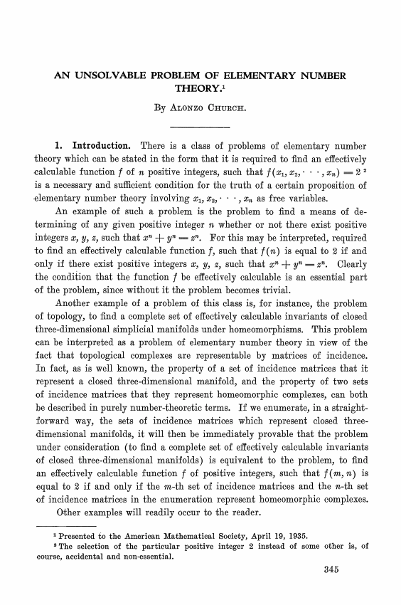

build-lists: true
autoscale: true

# Lambda Calculus in Elixir
## Bernardo Amorim
---

# Let’s play a game:
# Guess The Programming Language

---

[.background-color: #FFF]


---

[.background-color: #FFF]


---

[.background-color: #FFF]


---

# Similarities?

^ Have you seen what these languages have in common?

---

# [fit] λ
## Lambda

^ The Greek Letter Lambda is on their logos.

---

# Functional Programming Languages

^ And also, they all position themselves as functional programming languages.

---

# [fit] λ ≈ FP ?

^ So, why is the lambda letter is related to functional programming?

---

[.text: alignment(center)]

# Anonymous Functions
### ⠀
### ⠀

[.column]

## Python

```python
lambda x: x
```

[.column]

## Ruby

```ruby
lambda { |x| x }
```

^ If you go to Python or Ruby, for example, you use the keyword `lambda` in order to create an anonymous functions.

---



# Alonzo Church


^ That dates back to 1936, when Alonzo Church created this thing called lambda calculus in order to formalize computability.

---


^ Funny enough, it was published mostly at the same time that the famous paper from Alan Turing that introduced Turing Machines, which was later proven to be equivalent in terms on what they can compute.

---

# Turing Completeness
## and the Church-Turing thesis

^ Defines computability on what a Turing Machine or Lambda Calculus can compute. So a system is said to be turing-complete if it can implement a turing machine (or a lambda calculus reductor).

---

# Weird sub-set of Elixir

A programming challenge!

^ So, I’m going to create a challenge. The idea is to program in elixir using only the following subset of the language.

---

# Weird sub-set of Elixir

## Valid **terms** can be:

* Variable names such as `x`, `y`, or `my_variable`
* Anonymous functions definitions like `fn x -> BODY end` where `BODY` is also a valid **term**.
* Application of functions, like `A.(B)` where both `A` and `B` are valid **terms**.

---

# Weird sub-set of Elixir

```elixir
fn x -> x end
fn x -> x.(x) end
(fn x -> x end).(fn x -> x end)
fn _ -> fn x -> x end end
fn f -> fn x -> f.(x) end end
fn f -> fn x -> f.(f.(f.(f.(x)))) end end
```

---

[.text: alignment(center)]

# Weird sub-set of Elixir

This is **Turing-Complete**

---

# Don't trust me?

---

# Here is a factorial function.

---

```elixir
(fn f -> (fn x -> x.(x) end).(fn x -> f.(
fn y -> x.(x).(y) end) end) end).(fn fact ->
fn n -> (fn b -> fn tf -> fn ff -> b.(tf).(ff).(b)
end end end).((fn n -> n.(fn _ -> fn _ -> fn f ->
f end end end).(fn t -> fn _ -> t end end) end).
(n)).(fn _ -> fn f -> fn x -> f.(x) end end end).
(fn _ -> (fn n -> fn m -> fn f -> fn x -> n.(m.(f))
.(x) end end end end).(n).(fact.((fn n -> fn f ->
fn x -> n.(fn g -> fn h -> h.(g.(f)) end end).
(fn _ -> x end).(fn u -> u end) end end end).(n)))
end) end end)
```

^ Weird, right? I mean...

---


^ Wat. Makes no sense. Or does it?

---

```elixir
iex(5)> fact = (fn f -> (fn x -> x.(x) end).(fn x -> f.(fn y
-> x.(x).(y) end) end) end).(fn fact -> fn n -> (fn b -> fn
tf -> fn ff -> b.(tf).(ff).(b) end end end).((fn n -> n.(fn
_ -> fn _ -> fn f -> f end end end).(fn t -> fn _ -> t end
end) end).(n)).(fn _ -> fn f -> fn x -> f.(x) end end end).
(fn _ -> (fn n -> fn m -> fn f -> fn x -> n.(m.(f)).(x) end
end end end).(n).(fact.((fn n -> fn f -> fn x -> n.(fn g ->
fn h -> h.(g.(f)) end end).(fn _ -> x end).(fn u -> u end)
end end end).(n))) end) end end)
#Function<7.91303403/1 in :erl_eval.expr/5>
```

---

# Encoding and Decoding

```elixir
5
|> number_to_lambda.()
|> fact.()
|> lambda_to_number.()
```

^
Since this thing can only work with functions, we cannot pipe
Elixir Numbers into that, so we need some kind of encoding and decoding mechanism, which I'll assume we have for now (we actually do)

---

# Encoding and Decoding

```elixir
iex(6)> 5 |>
...(6)> number_to_lambda.() |>
...(6)> fact.() |>
...(6)> lambda_to_number.()
120
```

---


^ But don't panic, we are going to get there

---

# OK, What about λ-calculus?

---

# λ-calculus

* Formalism that defines computability
* Based on simple functions that:
  * Are anonymous
  * Are curried (1 argument function only)
* Defines a simple syntax for defining a **Lambda Term**

---

# λ-calculus syntax

| Constructor | Lambda |
| --- | --- |
| Variable | `x`, `y`, `my_var` |
| Abstraction | `λx. BODY` |
| Application | `A B` |

---

# Application is left associative

## a b c = (a b) c

## a b c ≠ a (b c)

^ This is like haskell

---

# Remember this?

```elixir
fn x -> x end
fn x -> x.(x) end
(fn x -> x end).(fn x -> x end)
fn _ -> fn x -> x end end
fn f -> fn x -> f.(x) end end
fn f -> fn x -> f.(f.(f.(f.(x)))) end end
```

---

# In λ-calculus

```
λx. x
λx. x x
(λx. x) (λx. x)
λf. λx. x
λf. λx. f x
λf. λx. f f f f x
```

---

# More Examples

* `λa. λb. b a`

  ```elixir
  fn a -> fn b -> a.(b) end end
  ```

* `λa. λb. b b a`

  ```elixir
  fn a -> fn b -> b.(b).(a) end end
  ```

* `λa. λb. b (b a)`

  ```elixir
  fn a -> fn b ->  b.(b.(a)) end end
  ```

* `λa. (λb. b) a)`

  ```elixir
  fn a -> (fn b ->  b end).(a) end
  ```

---

# The simplest λ-term

## The identity function

* `λx. x`

* ```elixir
  fn x -> x end
  ```

---

# The simplest λ-term

```elixir
iex(1)> id = fn x -> x end
#Function<7.91303403/1 in :erl_eval.expr/5>
iex(2)> id.(true)
true
```

---

# From λ to Factorial

---

# From λ to Factorial

```elixir
def fact(n) do
  if n == 0 do
    1
  else
    n * fact(n-1)
  end
end
```

---

# From λ to Factorial

[.code-highlight: none]
[.code-highlight: 1,4]
[.code-highlight: 3]
[.code-highlight: 2,8]
[.code-highlight: 5]
[.code-highlight: 7]
[.code-highlight: 1,6]

```elixir
def fact(n) do
  if(
    n == 0,
    do: 1,
    else: n * (
      fact(
        n-1
  )))
end
```

^
* Encode Natural Numbers
* Encode Booleans
* Is Zero?
* If/Then/Else
* Multiplication
* Predecessor (n-1; subtraction or just predecessor)
* Recursion

---
[.build-lists:false]

# So we need

- ☐ Encoding for Natural Numbers
- ☐ Encoding for Booleans
- ☐ Function to check if number is zero
- ☐ If/Then/Else
- ☐ Multiplication
- ☐ Predecessor
- ☐ Recursion

---

# Encoding Booleans

---

## That is: encode **True** and **False**

#### P.S.: There are infinite ways of doing this

---

# What are booleans used for?

---

# Branching
## Pick one of two paths

---

# It must be a function that will receive another function, at least

---

# `λ?. ???`

---

# Church Booleans

---

# `λthen. λelse. ???`

---

# True: `λthen. λelse. then`
# False: `λthen. λelse. else`

---

# In Elixir

```elixir
# True
fn then_path -> fn _ -> then_path end end

# False
fn _ -> fn false_path -> false_path end end
```

---

```elixir
iex(3)> true! = fn t -> fn _ -> t end end
#Function<7.91303403/1 in :erl_eval.expr/5>
iex(4)> false! = fn _ -> fn f -> f end end
#Function<7.91303403/1 in :erl_eval.expr/5>
iex(5)> true!.("This if true").("This if false")
"This if true"
iex(6)> false!.("This if true").("This if false")
"This if false"
```

---

# Decoding Booleans

---

## Need a way to check the result

---

# The output on iex is not helpful
```elixir
#Function<7.91303403/1 in :erl_eval.expr/5>
```

---

# Let's cheat

We can apply non-lambda terms to our lambda term

---

# Let's cheat

We can apply non-lambda terms to our lambda term

```elixir
  iex(7)> lambda_to_bool = fn b -> b.(true).(false) end
  #Function<7.91303403/1 in :erl_eval.expr/5>
  iex(8)> lambda_to_bool.(true!)
  true
  iex(9)> lambda_to_bool.(false!)
  false
  ```

---

# Operations on Booleans

---

# Not Function

---

# Not Function

| `a` | `not a` |
| --- | --- |
| `true` | `false` |
| `false` | `true` |

---

# Not Function

## `λa. ???`

---

# Not Function

## `λa. a FALSE TRUE`

---

# Not Function

```elixir
fn a ->
  a.(false!).(true!)
end
```

---

# Not Function

```elixir
iex(10)> not! = fn a -> a.(false!).(true!) end
#Function<7.91303403/1 in :erl_eval.expr/5>
iex(11)> true! |> not!.() |> lambda_to_bool.()
false
iex(12)> false! |> not!.() |> lambda_to_bool.()
true
```
---

# And Function

---

# And Function

| `a` | `b` | `and a b` |
| --- | --- | --- |
| `true` | `true` | `true` |
| `true` | `false` | `false` |
| `false` | `true` | `false` |
| `false` | `false` | `false` |

---

# And Function

## `λa. λb. ???`

^ It receives two booleans and has to do something with it

---

# And Function

## `λa. λb. a ??? ???`

^
We can start looking at a.
The thing is that not is a short-circuit on false values
That is, if one is false, then it doesn't matter the value of the
other because the result is going to be false

---

# And Function

## `λa. λb. a ??? FALSE`

^
In order to not depend on external definitions
We can use a because we know that is false already

---

# And Function

## `λa. λb. a b FALSE`

---

# And Function

```elixir
fn a -> fn b ->
  a.(b).(false!)
end end
```

---

# And Function

```elixir
iex(13)> and! = fn a -> fn b -> a.(b).(a) end end
#Function<7.91303403/1 in :erl_eval.expr/5>
iex(14)> and!.(true!).(true!) |> lambda_to_bool.()
true
iex(15)> and!.(true!).(false!) |> lambda_to_bool.()
false
iex(16)> and!.(false!).(true!) |> lambda_to_bool.()
false
iex(17)> and!.(false!).(false!) |> lambda_to_bool.()
false
```

---

# Or Function

* This is similar to and function, but short circuits on true instead of false
  * `λa. λb. a TRUE b`
* And it is proven that if you have `and` and `not` you can create all other logic gates
  * You actually just need `nand` which is a combination of `and` and `not`.

---
[.build-lists:false]

# What we have so far

- ☐ Encoding for Natural Numbers
- ☑ Encoding for Booleans
- ☐ Function to check if number is zero
- ☐ If/Then/Else
- ☐ Multiplication
- ☐ Predecessor
- ☐ Recursion

---

# Encoding Natural Numbers

---

# That is: encode **0**, **1**, **2**, ...

#### P.S.: There are also infinite ways of doing this

---

# What natural numbers are used for?

---

# Counting things

---

# Church Numerals

## Count the number of times a function is applied to a given input

### `N => λf. λx. F_APPLIED_TO_X_N_TIMES`

---

| Number | Encoding |
| :---: | --- |
| **0** | `λf. λx. x` |
| **1** | `λf. λx. f x` |
| **2** | `λf. λx. f (f x)` |
| **3** | `λf. λx. f (f (f x))` |
| **4** | `λf. λx. f (f (f (f x)))` |

---

# Constructing Natural Numbers

* We need zero
* And a way to get N+1 given N (successor)

---

# Zero

## `λf. λx. x`

---

# Zero

```elixir
fn _f -> fn x -> x end end
```

---

# Successor Function

## `λn. ???`

^
This is a function that receives a number and should return this number + 1
But we know the "form" of a function

---

# Successor function

## `λn. λf. λx. ???`

^
Now what the internal function should return is, if `n` receives a function and an input and applies the function to the input *N* times,
then we need to apply `f` *N+1* times to `x`.

---

# Successor function

## `λn. λf. λx. ??? (n f x)`

^
Well, `(n f x)` will already apply `f` to `x` *N* times
Then we just need to apply one more time.

---

# Successor function

## `λn. λf. λx. f (n f x)`

---

# Successor Function

```elixir
fn n -> fn f -> fn x ->
  f.(
    n.(f).(x)
  )
end end end
```

---

# Constructing Church Numerals

```elixir
ex(18)> zero = fn _f -> fn x -> x end end
#Function<7.91303403/1 in :erl_eval.expr/5>
iex(19)> succ = fn n -> fn f -> fn x -> f.(n.(f).(x)) end end end
#Function<7.91303403/1 in :erl_eval.expr/5>
iex(20)> one = succ.(zero)
#Function<7.91303403/1 in :erl_eval.expr/5>
iex(21)> two = succ.(succ.(zero))
#Function<7.91303403/1 in :erl_eval.expr/5>
```

---

# The output on iex is not helpful (again)
```elixir
#Function<7.91303403/1 in :erl_eval.expr/5>
```

---

# Encoding and Decoding Church Numerals

```elixir
# Encode
fn n -> n.(&(&1 + 1)).(0) end

# Decode
fn
  0 -> zero
  n -> Enum.reduce(1..n, zero, fn _, x -> succ.(x) end)
end
```

---

```elixir
iex(22)> lambda_to_number = fn n -> n.(&(&1 + 1)).(0) end
#Function<7.91303403/1 in :erl_eval.expr/5>
iex(23)> number_to_lambda = fn
...(23)>   0 -> zero
...(23)>   n -> Enum.reduce(1..n, zero, fn _, x -> succ.(x) end)
...(23)> end
#Function<7.91303403/1 in :erl_eval.expr/5>
```

---

```elixir
iex(24)> lambda_to_number.(zero)
0
iex(25)> lambda_to_number.(one)
1
iex(26)> lambda_to_number.(two)
2
iex(27)> lambda_to_number.(succ.(two))
3
iex(28)> 10 |> number_to_lambda.() |> succ.() |> lambda_to_number.()
11
```

---
[.build-lists:false]

# What we have so far

- ☑ Encoding for Natural Numbers
- ☑ Encoding for Booleans
- ☐ Function to check if number is zero
- ☐ If/Then/Else
- ☐ Multiplication
- ☐ Predecessor
- ☐ Recursion

---

# Is Zero?

---

# Is Zero?

## `λn. ???`

^ What can we do with n?

---

# Is Zero?

## `λn. n ?F? ?X?`

^
We can make it apply a function N times to an input
Think about it, zero will just return X and do nothing with it
So if N is zero, we want it to return TRUE

---

# Is Zero?

## `λn. n ?F? TRUE`

^
In all other cases, we want our function to return FALSE
So if F is applied at least once, we want it to return FALSE
We can then, create a function that always return FALSE

---

# Is Zero?

## `λn. n (λx. FALSE) TRUE`

---

# Is Zero?

```elixir
fn n ->
  n.(fn _ -> false! end).(true!)
end
```

---

```elixir
iex(29)> is_zero = fn n -> n.(fn _ -> false! end).(true!) end
#Function<7.91303403/1 in :erl_eval.expr/5>
iex(30)> zero |> is_zero.() |> lambda_to_bool.()
true
iex(31)> one |> is_zero.() |> lambda_to_bool.()
false
iex(32)> two |> is_zero.() |> lambda_to_bool.()
false
```

---
[.build-lists:false]

# What we have so far

- ☑ Encoding for Natural Numbers
- ☑ Encoding for Booleans
- ☑ Function to check if number is zero
- ☐ If/Then/Else
- ☐ Multiplication
- ☐ Predecessor
- ☐ Recursion

---

# If Then Else

* Isn't it just applying booleans to the branches?
* No, because Elixir is **eagerly evaluated**
* So we'll need to do one trick

---

## [fit] `λb. λthen. λelse. b then else ANY_VALUE`

---

```elixir
# ifte
fn b -> fn t -> fn e ->
  b.(t).(e).(b)
end end end

# Usage

ifte.(fn _ -> ... end).(fn _ -> ... end)
```

---

```elixir
iex(33)> ifte = fn b -> fn t -> fn e -> b.(t).(e).(b) end end end
#Function<7.91303403/1 in :erl_eval.expr/5>
iex(34)> ifte.(true!).(fn _ -> true end).(fn _ -> false end)
true
iex(35)> ifte.(false!).(fn _ -> true end).(fn _ -> false end)
false
```

---
[.build-lists:false]

# What we have so far

- ☑ Encoding for Natural Numbers
- ☑ Encoding for Booleans
- ☑ Function to check if number is zero
- ☑ If/Then/Else
- ☐ Multiplication
- ☐ Predecessor
- ☐ Recursion

---

# Multiplication

---

# Multiplication
## `λa. λb. ???`

^
We receive a and b, two numbers.
And then we must do something with that
But we know we need to return a number and we know the form of a number

---

# Multiplication
## `λa. λb. λf. λx. ???`

^
Great, so if a applies a given function to a given input A times
and b applies B times, we need to return a something that
applies a given function to a given input A*B times
(a f) is a function that applies f A times to a given input

---

# Multiplication
## `λa. λb. λf. λx. ??? (a f) ???`

^
So we if we apply (a f) B times, we are going to end with A*B applications
You know what function can help us do that? B!

---

# Multiplication
## `λa. λb. λf. λx. b (a f) ???`

---

# Multiplication
## `λa. λb. λf. λx. b (a f) x`

---

```elixir
fn a -> fn b -> fn f -> fn x ->
  b.(
    a.(f)
  ).(x)
end end end end
```

---

```elixir
iex(36)> mul = fn a -> fn b -> fn f -> fn x ->
...(36)>   b.(a.(f)).(x)
...(36)> end end end end
#Function<7.91303403/1 in :erl_eval.expr/5>
iex(37)> mul.
...(37)>   (number_to_lambda.(5)).
...(37)>   (number_to_lambda.(10)) |> lambda_to_number.()
50
```

---
[.build-lists:false]

# What we have so far

- ☑ Encoding for Natural Numbers
- ☑ Encoding for Booleans
- ☑ Function to check if number is zero
- ☑ If/Then/Else
- ☑ Multiplication
- ☐ Predecessor
- ☐ Recursion

---

# Predecessor Function

## Should be simple, right?

---

# Nope

---

> I'll left as an exercise to the reader
> - All book writers

---

# Predecessor Function

## [fit] `λn. λf. λx. n (λg. λh. h (g f)) (λu. x) (λu. u)`

---

```elixir
iex(38)> pred = fn n -> fn f -> fn x ->
...(38)>   n.(fn g -> fn h -> h.(g.(f)) end end).(fn _ -> x end).(fn u -> u end)
...(38)> end end end
#Function<7.91303403/1 in :erl_eval.expr/5>
iex(39)> 10 |> number_to_lambda.() |> pred.() |> lambda_to_number.()
9
```

---
[.build-lists:false]

# What we have so far

- ☑ Encoding for Natural Numbers
- ☑ Encoding for Booleans
- ☑ Function to check if number is zero
- ☑ If/Then/Else
- ☑ Multiplication
- ☑ Predecessor
- ☐ Recursion

---

# Recursion

---

# The problem with recursion

* All functions are anonymous
* Therefore, we cannot refer a function to itself by name
* Solution: **Abstract yourself**

---

# Abstract Yourself

* `λx. ?CALL_MY_SELF?`
* `λmyself. λx. myself x`

---

```
λfact. λn.
  IFTE
    (IS_ZERO n)
    (λx. ONE)
    (λx. (MUL n (fact (PRED n))))
```

---

```elixir
fn fact -> fn n ->
  ifte.(is_zero.(n)).(
    fn _ -> one end
  ).(
    fn _ -> mul.(n).(fact.(pred.(n))) end
  )
end end
```

---

```elixir
iex(40)> abs_fact = fn fact -> fn n ->
...(40)>   ifte.(is_zero.(n)).(
...(40)>     fn _ -> one end
...(40)>   ).(
...(40)>     fn _ -> mul.(n).(fact.(pred.(n))) end
...(40)>   )
...(40)> end end
#Function<7.91303403/1 in :erl_eval.expr/5>
```

---

# How do we use that?

* We need a "non abstracted" factorial
* To build it, we call the abstracted one with something
* This something is the "non abstracted" factorial
* Circular dependency?

---

# First solution: Fake it!

* When n is 0, factorial is not called
* Plug whatever function we want

---

# First solution: Fake it!

```elixir
iex(41)> 0 |> number_to_lambda.() |> abs_fact.(id).() |> lambda_to_number.()
1
iex(42)> 1 |> number_to_lambda.() |> abs_fact.(id).() |> lambda_to_number.()
0
```

---

# Why it does not work for 1?

* When n is 1, the function calls factorial again
* But factorial is not factorial, is id
* Id of n-1 is 0, then the multiplication result is 0

---

# Solution: Fake it one more time

```elixir
iex(43)> 1 |> number_to_lambda.() |> abs_fact.(abs_fact.(id)).() |> lambda_to_number.()
1
iex(44)> 2 |> number_to_lambda.() |> abs_fact.(abs_fact.(id)).() |> lambda_to_number.()
0
```

---

# We can keep faking it

```elixir
iex(45)> 3 |>
...(45)> number_to_lambda.() |>
...(45)> abs_fact.(abs_fact.(abs_fact.(abs_fact.(id)))).() |>
...(45)> lambda_to_number.()
6
iex(46)> 4 |>
...(46)> number_to_lambda.() |>
...(46)> abs_fact.(abs_fact.(abs_fact.(abs_fact.(id)))).() |>
...(46)> lambda_to_number.()
0
```

---

# What we need to do?

* How many times we need to apply the abstract function?
* One for every recursion
* We know that factorial of N is going to take N recursion

---

## [fit] `λn. abs_fact (?ABS_FACT_APPLIED_N_TIMES?) n`

^
Well, how can we apply the abstract factorial N times?
Fortunately enough, that is exactly what the church numerals do

---

## `λn. abs_fact (n abs_fact id) n`

---

```elixir
fn n ->
  abs_fact.(n.(abs_fact).(id)).(n)
end
```

---

```elixir
iex(47)> faux_fact = fn n -> abs_fact.(n.(abs_fact).(id)).(n) end
#Function<7.91303403/1 in :erl_eval.expr/5>
iex(48)> 3 |> number_to_lambda.() |> faux_fact.() |> lambda_to_number.()
6
iex(49)> 4 |> number_to_lambda.() |> faux_fact.() |> lambda_to_number.()
24
iex(50)> 5 |> number_to_lambda.() |> faux_fact.() |> lambda_to_number.()
120
```

---

# Is that general recursion?

---

# What if we don't know how many recursions will be necessary?

---

# What we have and what we need?

* We have an abstracted recursive function (`abs_fact`)
* We need to be able to generate something like this
  `abs_fact (abs_fact (abs_fact ...))`
* On demand / infinitely

---

# Fixed-point combinators

* Must have the property:
  `fix f = f (fix f)`
* Which if you expand once, you have:
  `      = f (f (fix f))`
* And if you keep expanding:
  `      = f (f (f (... (f (fix f)) ...)))`
* Good news: there is also infinite of these

---

# Y-Combinator

* It's not just an accelerator
* It's a fixed-point combinator for lambda calculus
* Discovered by **Haskell B. Curry**
* Defined as: `Y = λf (λx. f (x x)) (λx. f (x x)))`

---

# In Elixir

```elixir
# Can't I just do
y_combinator = fn ... end

# And apply
fact = y_combinator.(abs_fact)

# And use
fact.(...)
```

---

# Elixir is Eagerly Evaluated

* It evaluates things before passing as arguments
* That's why our `ifte` had then and else as functions
* That's why macros are used if you want to implement your if
* That's why the Y-Combinator does not work

---

# Z-Combinator

* Another fixed-point combinator
* Works in eagerly evaluated environments
* Trick is similar to what we've done in `ifte`
* Defined as: `Z = λf. (λx. x x) (λx. f (λy. x x y))`

---

```elixir
iex(51)> z_combinator = fn f ->
...(51)>   (fn x -> x.(x) end).(
...(51)>     fn x -> f.(fn y -> x.(x).(y) end) end
...(51)>   )
...(51)> end
#Function<7.91303403/1 in :erl_eval.expr/5>
iex(52)> fact = z_combinator.(abs_fact)
#Function<7.91303403/1 in :erl_eval.expr/5>
```

---

```elixir
iex(53)> 3 |> number_to_lambda.() |> fact.() |> lambda_to_number.()
6
iex(54)> 4 |> number_to_lambda.() |> fact.() |> lambda_to_number.()
24
iex(55)> 5 |> number_to_lambda.() |> fact.() |> lambda_to_number.()
120
```

---

# Thanks Folks!

---


# [fit] [github.com/bamorim/elixir-nyc-meetup-feb-2020](https://github.com/bamorim/elixir-nyc-meetup-feb-2020)